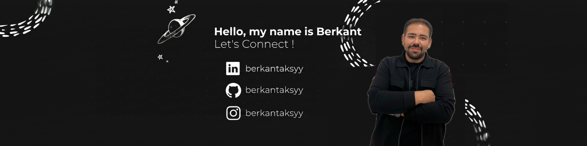
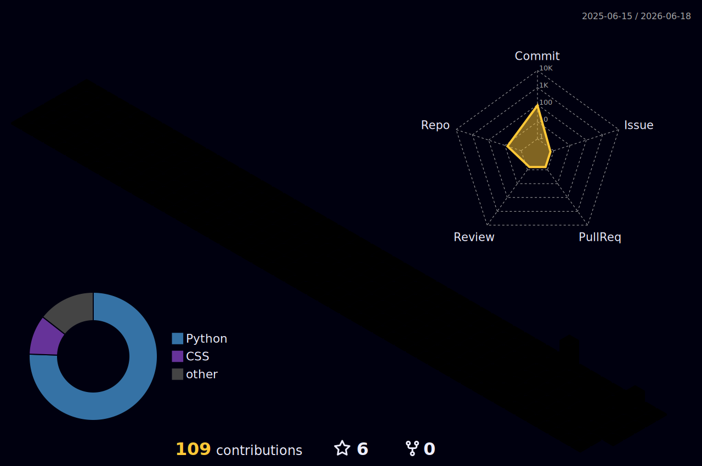

<!-- =================================================================== -->
<!--  BERKANT AKSOY  ·  GitHub Profile README                            -->
<!--  Repo:  berkantaksyy/berkantaksyy   (must be PUBLIC)                -->
<!-- =================================================================== -->

<!-- ====== BANNER ====================================================== -->

  

<h1 align="center">Berkant Aksoy</h1>
<h3 align="center">Full Stack &amp; AI Developer · Biomedical Engineer</h3>

<!-- ====== TYPING #1 — Roles (BLUE) ==================================== -->

  

<!-- ====== SOCIAL BADGES =============================================== -->

  
  
  
  

  <b>English (default)</b> &nbsp;·&nbsp; <a href="#türkçe">Türkçe</a>

<!-- ====== MATRIX RAIN (FIXED — via raw URL, XML escaped chars) ======== -->

  

<!-- =================================================================== -->
<!--                              ABOUT                                  -->
<!-- =================================================================== -->

<h2 align="center">About</h2>

Biomedical Engineering graduate from <b>İzmir Katip Çelebi University</b>, 
now pursuing my career as a <b>Full Stack &amp; AI Developer</b>.

<h3 align="center">Experience</h3>

<table align="center">
  <tr>
    <td align="right" width="220"><b>Undergraduate Researcher</b> Feb 2025 — Present</td>
    <td><b>Biomedical AI &amp; Neuroscience Lab — İKÇÜ</b> Advisor: Dr. Mehmet Akif Özdemir</td>
  </tr>
  <tr>
    <td align="right"><b>AI Engineer</b> 2025 — Present</td>
    <td><b>MEDAIGENCY / KillianAI</b> &nbsp;<code>Interreg EU</code> LLM-based autonomous agents for disaster response</td>
  </tr>
  <tr>
    <td align="right"><b>ML Engineer</b> 2025 — Present</td>
    <td><b>Genomic-AI</b> &nbsp;<code>TEKNOFEST 2026</code> Hybrid Transformer–XGBoost stacking · F1 0.898 · AUC 0.951</td>
  </tr>
  <tr>
    <td align="right"><b>Thesis Researcher</b> 2025 — 2026</td>
    <td><b>FossaNET</b> &nbsp;<code>Bachelor's Thesis</code> Real-time NIR forearm vein segmentation · Dice 0.737</td>
  </tr>
  <tr>
    <td align="right"><b>Biomedical Engineer Intern</b> Aug 2025 — Sep 2025</td>
    <td><b>Üzümcü Medical Devices</b> PCB analysis · Fault diagnosis · Maintenance</td>
  </tr>
  <tr>
    <td align="right"><b>Biomedical Engineer Intern</b> Jul 2024 — Oct 2024</td>
    <td><b>Uşak Training &amp; Research Hospital</b> Clinical device operations · Calibration · Repair</td>
  </tr>
</table>

 

<!-- ====== TYPING #2 — Currently Building (PURPLE) ===================== -->

  

<!-- ====== PROGRAMMING QUOTE =========================================== -->

  

<!-- ====== CAPSULE CYLINDER SEPARATOR (animated gradient pulse) ======== -->

  

<!-- =================================================================== -->
<!--                            TECH STACK                               -->
<!-- =================================================================== -->

<h2 align="center">Tech Stack</h2>

  

 

<!-- =================================================================== -->
<!--                          FEATURED PROJECTS                          -->
<!-- =================================================================== -->

<h2 align="center">Featured Projects</h2>

<table align="center">
  <tr>
    <td align="right"><b>Genomic-AI</b></td>
    <td>Transformer × XGBoost stacking ensemble</td>
    <td><code>F1 0.898 · AUC 0.951</code></td>
    <td>TEKNOFEST 2026</td>
  </tr>
  <tr>
    <td align="right"><b>FossaNET</b></td>
    <td>Real-time NIR vein segmentation</td>
    <td><code>Dice 0.737</code></td>
    <td>Bachelor's thesis</td>
  </tr>
  <tr>
    <td align="right"><b>MEDAIGENCY</b></td>
    <td>LLM agents for disaster response</td>
    <td><code>PostGIS · OSRM</code></td>
    <td>Interreg EU</td>
  </tr>
  <tr>
    <td align="right"><b>Vein Visualization</b></td>
    <td>Clinical NIR imaging device</td>
    <td><code>Image Processing</code></td>
    <td>TÜBİTAK 2209</td>
  </tr>
  <tr>
    <td align="right"><b>GlucoseDetect AI</b></td>
    <td>Non-enzymatic glucose estimation</td>
    <td><code>98% accuracy</code></td>
    <td>Flask · RF</td>
  </tr>
  <tr>
    <td align="right"><b>Wireless ECG</b></td>
    <td>RPi → Android over TCP/IP</td>
    <td><code>Live BPM · PDF</code></td>
    <td>Kotlin</td>
  </tr>
  <tr>
    <td align="right"><b>EMG Analysis</b></td>
    <td>Desktop signal processing tool</td>
    <td><code>RMS · FFT</code></td>
    <td>Python</td>
  </tr>
  <tr>
    <td align="right"><b>Papalagi UAV</b></td>
    <td>Autonomous flight algorithms</td>
    <td><code>Python · Linux</code></td>
    <td>TEKNOFEST</td>
  </tr>
</table>

 

<!-- ====== CAPSULE VENOM SEPARATOR (dripping/flowing animation) ======== -->

  

<!-- =================================================================== -->
<!--                              ACTIVITY                               -->
<!-- =================================================================== -->

<h2 align="center">Activity</h2>

<!-- 3D Contribution Graph -->

  

<!-- Activity Graph -->

  

<!-- Productive Time -->

  

<!-- Snake Animation -->

  <picture>
    <source media="(prefers-color-scheme: dark)" srcset="https://raw.githubusercontent.com/berkantaksyy/berkantaksyy/output/github-contribution-grid-snake-dark.svg" />
    <source media="(prefers-color-scheme: light)" srcset="https://raw.githubusercontent.com/berkantaksyy/berkantaksyy/output/github-contribution-grid-snake.svg" />
    
  </picture>

 

<!-- =================================================================== -->
<!--                        🎵  CURRENTLY LISTENING                      -->
<!-- =================================================================== -->

<h2 align="center">🎵 Currently Listening to</h2>

  

 

<!-- ====== TYPING #3 — Open to Collaborate (CYAN) ====================== -->

  

<!-- =================================================================== -->
<!--                              CONTACT                                -->
<!-- =================================================================== -->

<h2 align="center">Contact</h2>

  <a href="mailto:berkantaksyy@gmail.com">berkantaksyy@gmail.com</a> &nbsp;·&nbsp;
  <a href="https://www.linkedin.com/in/berkantaksyy">linkedin.com/in/berkantaksyy</a> &nbsp;·&nbsp;
  İzmir, Türkiye

 

---

<!-- =================================================================== -->
<!--                           TURKISH VERSION                           -->
<!-- =================================================================== -->

<h2>Türkçe</h2>

 

<h1 align="center">Berkant Aksoy</h1>
<h3 align="center">Full Stack &amp; AI Geliştirici · Biyomedikal Mühendisi</h3>

<h2 align="center">Hakkımda</h2>

<b>İzmir Katip Çelebi Üniversitesi</b> Biyomedikal Mühendisliği mezunuyum, 
kariyerime <b>Full Stack &amp; AI Geliştirici</b> olarak devam ediyorum.

<h3 align="center">Deneyim</h3>

<table align="center">
  <tr>
    <td align="right" width="220"><b>Lisans Araştırma Öğrencisi</b> Şub 2025 — Halen</td>
    <td><b>Biyomedikal Yapay Zekâ ve Nörobilim Lab. — İKÇÜ</b> Danışman: Dr. Mehmet Akif Özdemir</td>
  </tr>
  <tr>
    <td align="right"><b>AI Mühendisi</b> 2025 — Halen</td>
    <td><b>MEDAIGENCY / KillianAI</b> &nbsp;<code>Interreg AB</code> Afet müdahalesi için LLM tabanlı otonom ajanlar</td>
  </tr>
  <tr>
    <td align="right"><b>ML Mühendisi</b> 2025 — Halen</td>
    <td><b>Genomic-AI</b> &nbsp;<code>TEKNOFEST 2026</code> Hibrit Transformer–XGBoost stacking · F1 0.898 · AUC 0.951</td>
  </tr>
  <tr>
    <td align="right"><b>Tez Araştırmacısı</b> 2025 — 2026</td>
    <td><b>FossaNET</b> &nbsp;<code>Bitirme Tezi</code> Gerçek zamanlı NIR damar segmentasyonu · Dice 0.737</td>
  </tr>
  <tr>
    <td align="right"><b>Biyomedikal Müh. Stajyeri</b> Ağu 2025 — Eyl 2025</td>
    <td><b>Üzümcü Tıbbi Cihaz</b> PCB analizi · Arıza tespit · Bakım</td>
  </tr>
  <tr>
    <td align="right"><b>Biyomedikal Müh. Stajyeri</b> Tem 2024 — Eki 2024</td>
    <td><b>Uşak Eğitim ve Araştırma Hastanesi</b> Klinik cihaz işletimi · Kalibrasyon · Onarım</td>
  </tr>
</table>

<h2 align="center">Öne Çıkan Projeler</h2>

<table align="center">
  <tr>
    <td align="right"><b>Genomic-AI</b></td>
    <td>Transformer × XGBoost stacking ensemble</td>
    <td><code>F1 0.898 · AUC 0.951</code></td>
    <td>TEKNOFEST 2026</td>
  </tr>
  <tr>
    <td align="right"><b>FossaNET</b></td>
    <td>Gerçek zamanlı NIR damar segmentasyonu</td>
    <td><code>Dice 0.737</code></td>
    <td>Bitirme tezi</td>
  </tr>
  <tr>
    <td align="right"><b>MEDAIGENCY</b></td>
    <td>Afet müdahalesi için LLM ajanları</td>
    <td><code>PostGIS · OSRM</code></td>
    <td>Interreg AB</td>
  </tr>
  <tr>
    <td align="right"><b>Damar Görüntüleme</b></td>
    <td>Klinik NIR görüntüleme cihazı</td>
    <td><code>Görüntü İşleme</code></td>
    <td>TÜBİTAK 2209</td>
  </tr>
  <tr>
    <td align="right"><b>GlucoseDetect AI</b></td>
    <td>Non-enzimatik glikoz tahmini</td>
    <td><code>%98 doğruluk</code></td>
    <td>Flask · RF</td>
  </tr>
  <tr>
    <td align="right"><b>Kablosuz EKG</b></td>
    <td>RPi → Android, TCP/IP üzerinden</td>
    <td><code>Anlık BPM · PDF</code></td>
    <td>Kotlin</td>
  </tr>
  <tr>
    <td align="right"><b>EMG Analiz</b></td>
    <td>Masaüstü sinyal işleme aracı</td>
    <td><code>RMS · FFT</code></td>
    <td>Python</td>
  </tr>
  <tr>
    <td align="right"><b>Papalagi İHA</b></td>
    <td>Otonom uçuş algoritmaları</td>
    <td><code>Python · Linux</code></td>
    <td>TEKNOFEST</td>
  </tr>
</table>

<h2 align="center">İletişim</h2>

  <a href="mailto:berkantaksyy@gmail.com">berkantaksyy@gmail.com</a> &nbsp;·&nbsp;
  <a href="https://www.linkedin.com/in/berkantaksyy">linkedin.com/in/berkantaksyy</a> &nbsp;·&nbsp;
  İzmir, Türkiye

 

<!-- ====== ANIMATED WAVE FOOTER ======================================== -->

  

  

